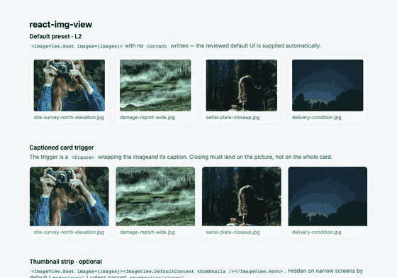

# 图片预览组件的另一种设计：Headless、可组合、开箱即用

> React 的图片预览组件已经很多了。我决定再写一个，并不是因为缩放、拖拽、旋转这些功能没人做，而是因为现有组件一旦遇到自定义界面，往往很快就会碰到边界。
改颜色通常不难，但如果要移动工具栏、替换内部按钮、调整预览布局，render props 和 CSS 覆盖很快就不够用了。继续增加配置项会让 API 越来越复杂，直接 fork 又意味着长期维护一份自己的代码。
> react-img-view 想解决的正是这个问题：常用功能和默认界面开箱即用，同时把预览器拆成可以自由组合的部件。简单场景一行接入，需要深度定制时，也不必推翻原来的实现。

## 先看效果



在线可玩的 Demo 在文档首页：[baron04.github.io/react-img-view/zh/](https://baron04.github.io/react-img-view/zh/)，点任意一张图片就能试。

几个值得注意的细节：

- 图片放大后拖到边缘，**手势会直接接力翻到下一张**，中途不卡顿；
- 鼠标滚轮缩放时，**指针指着哪里，哪里就留在原地**放大，图片不会从鼠标底下跑走；
- 从缩略图打开时，图片像从缩略图里"展开"，关闭时准确飞回原位——即使缩略图是 `object-fit: cover` 裁过的。

## 它是什么

一句话：**把缩放、拖动、翻页、动画和键盘操作这些难写的部分留在库里，把界面的决定权还给使用者。**

```bash
npm install react-img-view
```

单张图片，一行接入：

```tsx
import { ImageView } from 'react-img-view'
import zhCN from 'react-img-view/locales/zh-CN'
import 'react-img-view/styles.css'

function SingleImagePreview({ image }) {
  return (
    <ImageView src={image.full} alt={image.name} name={image.name} labels={zhCN}>
      
    </ImageView>
  )
}
```

多张图片共享一个预览器：

```tsx
<ImageView.Root images={images} labels={zhCN}>
  {images.map((image, i) => (
    <ImageView.Trigger key={image.src} index={i} {...image}>
      
    </ImageView.Trigger>
  ))}
</ImageView.Root>
```

需要完全自定义界面时，不用换库、不用自己接管状态，从 `react-img-view/primitives` 把部件重新拼一次就行（后面有完整示例）。**从一行用法到完全自定义，只是逐步打开同一个组件，中间不存在“推翻重写”。**

几种使用方式怎么选：

| 方式                         | 适合场景                         | 用法                                                               |
| ---------------------------- | -------------------------------- | ------------------------------------------------------------------ |
| `ImageView` 单图             | 一张图挂个大图预览               | 包一下缩略图即可                                                   |
| `ImageView.Root` + `Trigger` | 图片列表、缩略图墙               | 所有触发器共享一个预览器                                           |
| 函数式调用                   | 没有缩略图，从按钮或接口回调打开 | `ImagePreview.open({ images, index })`                             |
| `primitives` 完全组合        | 需要重排布局、替换内部组件       | 用同一批部件自己拼界面                                             |
| 受控模式                     | 预览状态要由外部持有             | 向 `Root` 传入 `open` / `index` / `onOpenChange` / `onIndexChange` |

界面也有三种拿到方式：引一份 **CSS 预设**开箱即用；用 **shadcn registry** 把 Tailwind 源码装进项目直接改；或从 **primitives** 完全自己拼。三者详见后文架构一节。

函数式调用直接使用 `ImagePreview.open()`：

```tsx
import { ImagePreview } from 'react-img-view/imperative'

const preview = ImagePreview.open({ images, index: 2, labels: zhCN })
preview.next()
preview.close()
```

关闭按钮、Escape 和 `close()` 都会触发自动清理，不需要手动销毁。大图本身也不是
写死的：`renderImage` 可以接入 `<picture>`、项目自己的图片组件、额外图片属性和
业务加载事件；把库提供的 `imageProps` 交给最终的 ``，尺寸、加载状态、重试和
变换逻辑仍然有效。

## 为什么又造一个轮子

React 生态里图片预览组件并不少，我最初也只是想给项目里的图片列表加个大图预览。但接进业务以后，最常遇到的问题不是"功能不够"，而是**改不动**：

- 想换个配色，要覆盖一串内部选择器；
- 想把工具栏从顶部挪到底部，没有对应的 prop；
- 想复用项目里的 Button 和 Icon，render 插槽只能往固定位置塞内容，替换不了内部组件；
- 组件需要靠不断加 prop 才能适应新需求，最后只剩覆盖 CSS、fork 源码、或者劝设计师别改了三条路。

调研了一圈现有方案（详细源码分析见文末）：

| 方案                                                                  | 结论                                                                                                                                                       |
| --------------------------------------------------------------------- | ---------------------------------------------------------------------------------------------------------------------------------------------------------- |
| [react-photo-view](https://github.com/MinJieLiu/react-photo-view)     | 体积很小，手势体验极佳。但扩展只有 `toolbarRender` 一类的渲染插槽，整体外壳仍由组件管理，重新安排布局做不到                                                |
| [yet-another-react-lightbox](https://yet-another-react-lightbox.com/) | 插件系统能力很强，可以做深度布局改造，但插件 + 模块树体系对普通图片预览重了一圈，且面向媒体画廊设计                                                        |
| Ant Design `Image`                                                    | 有 `toolbarRender` / `imageRender` 等插槽，能换工具栏内容和预览节点，但布局结构固定、内部组件替换不了，样式绑定 antd；项目用 antd 时省事，脱离后方便变约束 |

问题不在这些库，而在场景和抽象不匹配。所以我想要的是第三种东西：**Headless、可组合，同时仍然提供一套好用的默认界面。**

## ✨ 核心特性

**交互能力**

- 缩放、拖拽平移、双指捏合（滚轮 / 触控板 / 触摸屏共用同一套算法）
- 旋转、适应窗口、独立的 1:1 原始尺寸按钮
- 手势接力：放大后的图片拖到边缘，无缝交给翻页
- 下滑关闭只响应触摸与手写笔，鼠标拖拽永远不会误关预览
- 完整的键盘快捷键（见下表）

**界面定制**

- 每一个可见部件都对外导出：`Root` / `Content` / `Stage` / `Image` / `Toolbar` / `Thumbnails` / 各控件
- 控件支持 Radix 风格的 `asChild`，直接复用你项目里的 Button、Icon，不多包一层 DOM
- `renderImage` 可以替换大图渲染，接入 `<picture>`、业务图片组件、额外属性和加载事件
- 状态通过 `data-active` / `data-boundary` / `data-disabled` / `data-phase` 属性暴露，写样式不用复制内部状态
- `useViewer()` 在任意子组件读取缩放、序号、加载等运行时状态

**接入方式**

- 单图一行、多图一个组件、函数式调用、完全组合，共用同一套预览能力（见前文选型表）
- 函数式调用：`ImagePreview.open({ images, index })` 直接打开；返回的句柄提供 `close()` / `go()` / `next()` / `prev()`，关闭后自动清理
- 受控模式：`open` / `index` / `onOpenChange` / `onIndexChange`
- 中文文案按需引入 `react-img-view/locales/zh-CN`，默认英文固定，SSR 与 hydration 永不漂移

**工程质量**

- 零运行时依赖（除 React），支持 React 18 / 19，TypeScript 全量类型
- 加载失败有可重试的错误态，加载中有 loading 部件
- 关闭后焦点还给原缩略图，滚动锁、读屏提示齐全
- 体积有 CI 门禁，单测回放指针事件序列，另有真实浏览器 E2E 与视觉回归测试

**键盘快捷键**

| 按键            | 操作              |
| --------------- | ----------------- |
| `←` / `→`       | 上一张 / 下一张   |
| `Home` / `End`  | 第一张 / 最后一张 |
| `+` / `-`       | 放大 / 缩小       |
| `0`             | 适应窗口          |
| `1`             | 原始尺寸（1:1）   |
| `R` / `Shift+R` | 向右 / 向左旋转   |
| `Esc`           | 关闭              |

## 📊 和流行库比一比

| 维度                          | react-img-view                        | react-photo-view            | yet-another-react-lightbox | antd Image  |
| ----------------------------- | ------------------------------------- | --------------------------- | -------------------------- | ----------- |
| 定制方式                      | **Headless 部件，组件可组合、可替换** | 渲染插槽（工具栏 / 覆盖层） | 插件系统（模块树操作）     | 有限配置项  |
| 替换控件元素（`asChild`）     | ✅                                    | ❌                          | 部分                       | ❌          |
| 替换大图渲染（`renderImage`） | ✅                                    | ✅                          | ✅                         | ✅          |
| 手势接力（拖到边缘无缝翻页）  | ✅                                    | ❌                          | ❌                         | ❌          |
| 鼠标滚轮定点缩放              | ✅                                    | ✅                          | ✅                         | ⚠️ 位置不准 |
| 缩略图裁切感知动画（cover）   | ✅ 自动                               | ✅ 自动                     | —                          | ❌          |
| 移动端手势                    | ✅                                    | ✅                          | ✅                         | ❌          |
| 函数式调用                    | ✅                                    | ❌                          | ❌                         | ❌          |
| Tailwind / shadcn 源码集成    | ✅                                    | ❌                          | ❌                         | ❌          |
| 键盘 + 焦点管理               | ✅ 完整                               | ✅ 键盘                     | ✅                         | ✅          |
| 自动播放                      | ❌                                    | ❌                          | ✅ 插件                    | ❌          |

> 对比基于各库公开文档与源码分析，力求客观：react-photo-view 在体积和手势打磨上仍是标杆；做视频画廊请选 yet-another-react-lightbox 或 PhotoSwipe。react-img-view 的差异化在 **Headless 可组合，每一个可见部件都能替换**。

## 🔧 三层架构

```text
core                  手势状态机、几何变换、动画 —— 不依赖 React
  ↓
primitives            Root、Content、Stage、Image、各类控件 —— 不依赖默认界面
  ↓
preset（主入口）        默认工具栏、图标、缩略图和样式 —— 开箱即用
```

- `react-img-view/core`：不依赖 React，只用一个 helper 时可以 tree-shake 到极小；
- `react-img-view/primitives`：自己拼界面用，默认工具栏、图标、文案都不会打进 bundle；
- 主入口：完整默认界面，再配一份轻量的 CSS 预设。

各入口的最新体积以 README 顶部的 size 徽章为准，仓库里有 CI 体积门禁，不会悄悄变胖。

“可以完全自定义”和“必须完全自定义”是两回事。只使用 `primitives` 的项目享受按需体积，想先跑起来的项目引一份 CSS 就有完整界面——两者不冲突，因为**默认界面本身就是用同一批 primitives 拼出来的**。

默认界面有三种拿到方式，按定制深度从浅到深：

```ts
// ① CSS 预设：引一份样式，默认界面开箱即用，任何项目都能用
import 'react-img-view/styles.css'
```

```bash
# ② shadcn registry 区块：Tailwind 源码装进项目，JSX 和 className 随便改
npx shadcn add https://baron04.github.io/react-img-view/r/image-view.json
```

shadcn 方式复制进来的只是呈现层（JSX + className），手势、弹窗、键盘、动画仍然是对 `react-img-view` 的真实依赖。

```tsx
// ③ primitives 完全组合：部件的位置、元素、渲染与否全由你定
import * as ImageView from 'react-img-view/primitives'

function CustomViewer({ images }) {
  return (
    <ImageView.Root images={images}>
      {/* triggers */}
      <ImageView.Content className="riv-dialog">
        <ImageView.Header>
          <ImageView.Close asChild>
            <MyIconButton icon={<CloseIcon />} aria-label="关闭" />
          </ImageView.Close>
          <ImageView.Title />
          <ImageView.Download />
        </ImageView.Header>

        <ImageView.Stage>
          <ImageView.Image />
          <ImageView.Prev>‹</ImageView.Prev>
          <ImageView.Next>›</ImageView.Next>
          <ImageView.Error>
            {({ retry }) => (
              <div>
                <p>无法加载这张图片</p>
                <button onClick={retry}>重试</button>
              </div>
            )}
          </ImageView.Error>
          <ImageView.Toolbar>
            <ImageView.ZoomOut asChild>
              <MyIconButton icon={<ZoomOutIcon />} />
            </ImageView.ZoomOut>
            <ImageView.ZoomIn asChild>
              <MyIconButton icon={<ZoomInIcon />} />
            </ImageView.ZoomIn>
            <ImageView.ActualSize />
          </ImageView.Toolbar>
        </ImageView.Stage>
      </ImageView.Content>
    </ImageView.Root>
  )
}
```

## 🔍 几个"难写的部分"是怎么做的

工具栏按钮谁都会写，真正花时间的是下面这些。这部分也是给想翻源码或对实现好奇的同学。

**1. 手势接力：一个纯函数状态机，而不是一堆布尔值**

图片放大后横向拖动，先应该移动图片；到达边缘后继续拖，又应该翻页。谁优先都不对。react-img-view 把手势写成纯函数状态机：

```text
idle → tracking → panning → paging
                 ↘ dismissing
        ↘ pinching
```

手指按下先 `tracking`，移动超过阈值才判断意图；放大图片先进 `panning`，拖过边缘交接阈值才切到 `paging`。切换时，已经拖出去的那段距离（`overshoot`）会一起交给下一个状态——否则图片会在手指底下跳一下。

状态机不碰 DOM、不依赖 React，单测只需回放事件就能覆盖快速滑动、双指缩放、下滑取消、`pointercancel`：

```ts
pointerdown(600, 300)
pointermove(100, 300)
pointerup()
// → commands: [{ type: 'page', direction: 1 }]
```

**2. 定点缩放：滚轮/触控板/双指共用一套公式**

只改 `scale`，图片永远围绕中心缩放，指针指着的内容会跑走。要让指针下的内容留在原地，缩放时同步修正位置：

```ts
const ratio = nextScale / scale
nextX = originX - (originX - x) * ratio
nextY = originY - (originY - y) * ratio
```

`origin` 可以是鼠标位置，也可以是双指中点——滚轮、触控板捏合、触屏双指因此共用同一个 `zoomAbout`，不会各写一套略有差异的算法。

**3. 开关动画：FLIP + 缩略图裁切感知**

打开关闭用 FLIP：先读缩略图位置，把大图放到同一位置，再动画到适应窗口的状态。这里有个坑：缩略图常用 `object-fit: cover`，显示的是裁过的一部分，大图却是完整图片——只对宽高和位置做动画，第一帧就对不上。现在动画帧除了 `transform` 还计算四个方向的 crop：`cover` 缩略图先用相同裁切起飞，动画过程中再还原完整图片。这类细节不在任何功能列表里，却决定了组件看起来像产品还是"弹了张大图"。

所有手势阈值和动画参数集中在 [`src/core/tuning.ts`](https://github.com/baron04/react-img-view/blob/main/src/core/tuning.ts) 一个文件里。哪个手势手感不对，改那里就行——**一个改数值的 PR，附上是在什么设备上试的，正是这个项目现在最想要的贡献。**

## 链接都在这

```bash
npm install react-img-view
```

- GitHub：[github.com/baron04/react-img-view](https://github.com/baron04/react-img-view)
- 中文文档（含可玩 Demo）：[baron04.github.io/react-img-view/zh/](https://baron04.github.io/react-img-view/zh/)
- API 参考：[baron04.github.io/react-img-view/zh/api-reference/](https://baron04.github.io/react-img-view/zh/api-reference/)

## 写在最后

促使我写 react-img-view 的，不是社区缺一个能放大图片的组件，而是一次次遇到"这个位置改不了""这个按钮换不掉"。当组件需要靠不断加 prop 适应新需求时，问题往往不在 prop 不够多，而在抽象边界放错了位置。

Headless 和可组合是这个项目给出的答案：**库把难写的交互做好，应用保留自己的界面。** 简单时一行接入，复杂时逐层拆开，中间不用换实现。

如果它帮你解决过实际问题，欢迎去 GitHub 点个 ⭐，这是对开源项目最实在的支持。遇到手势手感、定制边界上的问题，Issue 和 PR 都欢迎——尤其是 `tuning.ts` 里带设备信息的调参 PR。
